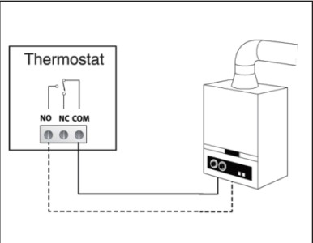
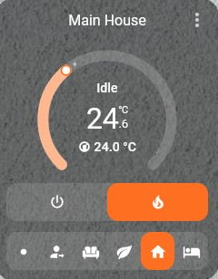

İstilik sisteminin (boiler/kombi) ağıllı idarəedilməsi həm rahatlıq, həm də ciddi maliyyə qənaətidir. Biz kombiləri Home Assistant-a ən təhlükəsiz metod olan **"Dry Contact" (Quru Kontakt)** ilə inteqrasiya edirik.

*Şəkil 1: Kombi anakartına quru kontakt rölesinin qoşulma nöqtəsi.*

### Texniki Həll: Dry Contact nədir?
Bir çox müasir kombilər xarici termostat üçün xüsusi girişə malikdir. Biz bu girişə Zigbee və ya Wi-Fi dəstəkli bir "Relay" (məsələn: Sonoff və ya Shelly) qoşuruq. Bu modul heç bir gərginlik vermədən (potential-free) yalnız dövrəni qapayaraq kombini işə salır və ya söndürür.

*Şəkil 2: Home Assistant üzərindən temperaturun idarə edilməsi.*

### Avtomatlaşdırma imkanları:
* **Hər otağa fərdi nəzarət:** Hər otaqda kiçik temperatur sensorları yerləşdirərək, kombini yalnız ehtiyac olan otağa görə işlətmək.
* **Qənaət:** Statik termostatlarla müqayisədə ağıllı sistemlər qaz sərfiyyatını 25-30% azaldır.
